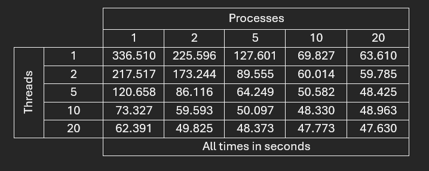
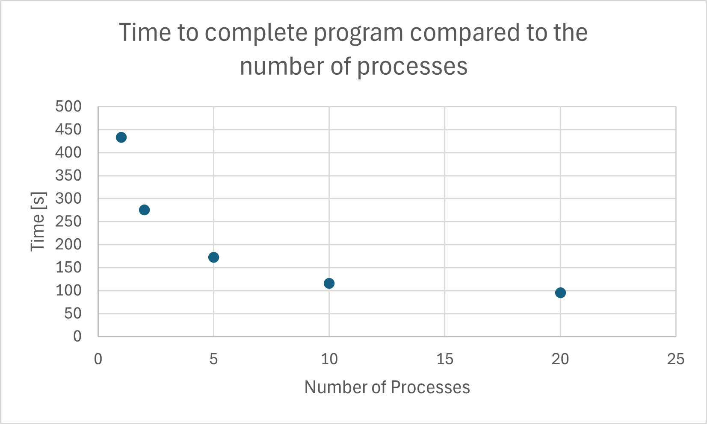

# System Programming Lab 12 Multithreading
#### By: Tyler Blaine

### Overview of Updated Program
The new program now makes use of multithreading on top of the previous implementation of multiprocessing. Now it can split each image into multiple parts and have the threads complete a single part of it. This as shown below can further improve the runtimes.

### Table of Results

### Discussion of Results
1. Looking at the table above, one can see that multiprocessing and multithreading on there own are very similar. With that said, I would say multithreading has a slight edge on performance. I would assume that it is better because the picture can be easliy split into many parts, like how the lab assignment said it's "embarrassingly parallel". 
2. The "sweet spot" was really anywhere in the bottom right hand corner of the table. Eventually, one can see they are all within about a second or two of each other. 

# System Programming Lab 11 Multiprocessing
#### By: Tyler Blaine

### Overview of Program
The edited mandel.c program creates a sequence of images of the Mandelbrot set. It takes in a bunch
of parameters to change the set. One of the parameters determines the number of processes to create the image
set. This is done by forking a number of times to get multiple processes to speed up the program.

### Graph of Results

### Discussion of Results
The graph shows what looks like an exponential decay. As the number of processes increases the time it takes to 
complete the set decreases. But like previously mentioned the decay is exponential as it decreases most by adding a few extra processes but there seems to be diminishing returns as more processes are added. 

NOTE: I used the .mp4 extension as .mpg was not running on my computer